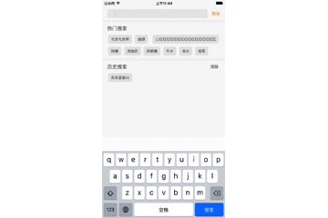

# SearchView


一个自定义的SearchView,带有block方便事件处理 一行代码搞定一个搜索页面处理



##使用方法

在需要的地方初始化 

``` 
/**
*  初始化
*
*  @param frame    搜索页面的frame
*  @param parament  传入热搜参数
*  @param search   搜索时间block
*
*  @return 返回SearchView
*/
- (instancetype)initSearchViewWithFrame:(CGRect)frame Parament:(id)parament search:(Search)search;``` 


 


 


###Manual Installation

将SearchView文件夹拖拽到你的工程,配置基本参数宏定义

